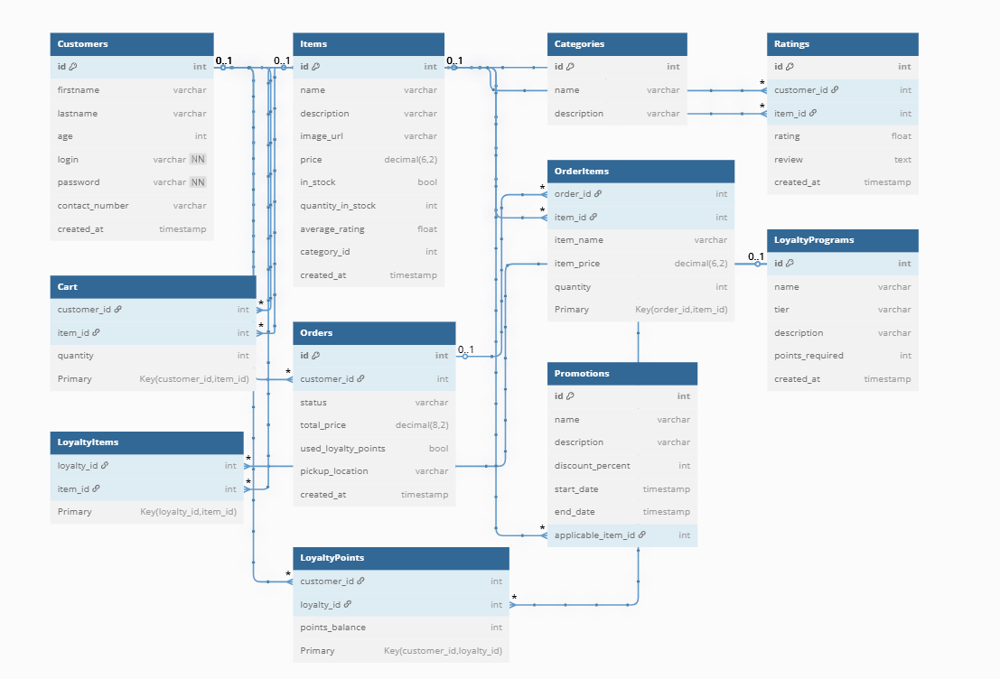

# 📕 Coffee Shop App

### The Library Specialty Coffee
I'm not much of a coffee drinker, but The Library delivered one of the best coffee experiences I've ever had. Right now, they're a small, single-location cafe, but let's imagine they scaled up and wanted a mobile app to match the quality of their in-store service. This project builds a simple database system for The Library that can handle their day to day operations.

### ERD:

### Table Design
- **Customers**: Stores user profile and login information
- **Items**: Stores all products sold by the shop
- **Categories**: Groups items into their various types, for e.g. "Coffee", "Tea", "Baked Goods", etc.
- **Ratings**: Records customer reviews and stars ratings for items
- **Cart**: Temporary cart mechanism to hold all the items the customer wants to buy
- **Orders**: Tracks finalized purchases, whether pending, paid or fulfilled
- **OrderItems**: Stores price and quantity at purchase time of each item in the order
- **LoyaltyPrograms**: Defines the point-based rewards system
- **LoyaltyItems**: Connects Loyalty programs to redeemable items
- **LoyaltyPoints**: Tracks each customer's loyalty program enrollment and points balance.
- **Promotions**: Time-bound discounts 

### Tools
- **MySQL**: Backend schema and queries
- **Figma**: Frontend UI design and flow (coming soon)

### How it Works:
When someone buys an item in the app, the frontend sends a request to the backend via an API endpoint. This backend receives the request, validates the data, calculates the totals and final values, then executes the SQL commands to insert the order and related details into the database. The SQL database, built here, stores the information permanently and the backend sends a response back to the frontend (order confirmation) and will update the app to show this. 

